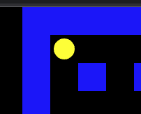

 PAC-MAN game engine
=====================

### Базовые елементы: 

 * Хук `useGameinitialization` -  представляет собой функцию, реализующую логику инициализации игры. Он используется для настройки начальных параметров игры, создания элементов, обработки событий и анимации. 

 * Класс `Boundary` - представляет границу игрового поля в контексте простой игры на React с использованием HTML Canvas.
    
    #### Cвойства:

    Название        | описание
    ----------------|----------------------
    position (положение) | Представляет координаты верхнего левого угла границы.
    width (ширина) | Статическое свойство класса Boundary, задает ширину границы.
    height (высота) | Статическое свойство класса Boundary, задает высоту границы.
    ctx (контекст рендеринга) | Представляет контекст рендеринга Canvas, необходимый для отрисовки границы.

    ####  Методы:

    Название        | описание
    ----------------|----------------------
    draw()  | Отрисовывает границу на холсте. Использует контекст рендеринга для заполнения прямоугольной области с цветом 'blue' на основе координат и размеров границы.

 * Класс `Player` -  представляет собой игрового персонажа в простой игре на React с использованием HTML Canvas.

     #### Cвойства:

    Название        | описание
    ----------------|----------------------
    position (положение) | Представляет текущее положение игрока на игровом поле.
    velocity (скорость) | Представляет текущую скорость движения игрока по осям X и Y.
    radius (радиус) | Задает радиус игрока. Может быть использован для определения столкновений.
    ctx (контекст рендеринга) | Представляет контекст рендеринга Canvas, необходимый для отрисовки границы.

    ####  Методы:

    Название        | описание
    ----------------|----------------------
    draw()  | Отрисовывает игрока на холсте. Использует контекст рендеринга для отрисовки круга представляющего игрока.
    update() | Обновляет положение игрока на основе текущей скорости. Этот метод вызывается в цикле анимации для обновления позиции игрока.

* `circleCollidesWithRectangle` - функция  выполняет проверку на столкновение между окружностью и границами карты 

* `animate` - функция отвечает за анимацию игрового цикла, которая передается в `requestAnimationFrame`

###  Карта:

Массив `map` представляет собой игровую карту с различными тайлами. Каждый символ в массиве соответствует определенному элементу в игре. Ниже приведен легендарный ключ, предоставляющий информацию о каждом символе и соответствующем элементе:

- `1`:  Угол трубы 1
- `2`:  Угол трубы 2
- `3`:  Угол трубы 3
- `4`:  Угол трубы 4
- `b`:  Блок
- `[`:  Крышка слева
- `]`:  Крышка справа
- `_`:  Крышка снизу
- `^`:  Крышка сверху
- `+`:  Перекрестие трубы
- `5`:  Коннектор трубы сверху
- `6`:  Коннектор трубы справа
- `7`:  Коннектор трубы снизу
- `8`:  Коннектор трубы слева


#### Инициализация Границ из Карты:

При инициализации игры, класс Boundary создается для каждого символа (описанного выше )на карте. Происходит пробег по каждому символу на карте, и если символ соответствует границе, создается экземпляр класса Boundary с учетом позиции символа на карте и добавляется в массив `boundaries`.

```javascript
    map.forEach((row, indexRow) => {
      row.forEach((symbol, indexSymbol) => {
        const block = mapElements[symbol]
        if (block) {
          boundaries.push(
            new Boundary({
              position: {
                x: Boundary.width * indexSymbol,
                y: Boundary.height * indexRow,
              },
              ctx,
              image: createImg(block),
            })
          )
        }
      })
    })–
 ```

далее в функции `animate()` пробегаемся по массиву `boundaries` и вызываем у кождого блока метод `drow()`, который oтрисовывает границу на холсте.

```javascript
    boundaries.forEach(boundary => {
      boundary.draw()
```

 ### Игрок:

 #### Инициализация Игрока (Player):

При инициализации игры создается экземпляр класса Player, который представляет игрового персонажа.
Игроку устанавливаются начальные координаты (position), начальная скорость (velocity), и контекст рендеринга (ctx), необходимый для отрисовки.

```javascript
const player: Player = new Player({
  position: {
    x: Boundary.width + Boundary.width / 2,
    y: Boundary.height + Boundary.height / 2,
  },
  velocity: {
    x: 0,
    y: 0,
  },
  ctx,
});
 ```


 изначальная позизия игрока в верхнем левом углу (x:60, y:60)

 #### Управление Игроком:

 Игрок управляется с помощью клавиш W, A, S, D. Когда клавиша нажата (keyDown), устанавливается соответствующий флаг в объекте keys. Когда клавиша отпущена (keyUp), флаг устанавливается в false. Так же запоминается последняя нажатая клавиша.   
 
 Далее в функции `animate` идет установка или сброс скорости игрока .
  * Пример на зажатой клавиши `w` (вверх):

    ```javascript
    if (w.pressed && lastKey === 'w') {
    for (let i = 0; i < boundaries.length; i++) {
        const boundary = boundaries[i];
        if (
        circleCollidesWithRectangle({
            circle: { ...player, velocity: { x: 0, y: -5 } },
            rectangle: boundary,
        })
        ) {
        player.velocity.y = 0;
        break;
        } else {
        player.velocity.y = -5;
        }
    }
    }
    ```
    1)  if (w.pressed && lastKey === 'w') проверяет, нажата ли клавиша "W" (w.pressed === true) и является ли она последней нажатой клавишей (lastKey === 'w').
    2) Цикл for перебирает все границы на игровом поле.
    3) Проверка Столкновения с Границей. Для каждой границы выполняется проверка столкновения между игроком и границей.
    4) Проверка Столкновения с Границей:
        * Если столкновение обнаружено, устанавливается player.velocity.y = 0, что означает, что скорость по вертикали обнуляется, и игрок останавливается.
        * Если столкновение не обнаружено, устанавливается player.velocity.y = -5, что означает, что игрок продолжит движение вверх с заданной скоростью.
    5) После обнаружения столкновения и остановки движения, оператор break прерывает выполнение цикла. Это делается для того, чтобы не проверять столкновение с остальными границами, так как игрок уже столкнулся с одной из них.

    Так же независимо от того зажата ли клавиша или нет, игрок остановится при столкновением с границей, для этого есть отедельное наблюдение там же где и рисуется карта.

```javascript
    boundaries.forEach(boundary => {
      boundary.draw()
      if (
        circleCollidesWithRectangle({ circle: player, rectangle: boundary })
      ) {
        player.velocity.x = 0
        player.velocity.y = 0
      }
```


